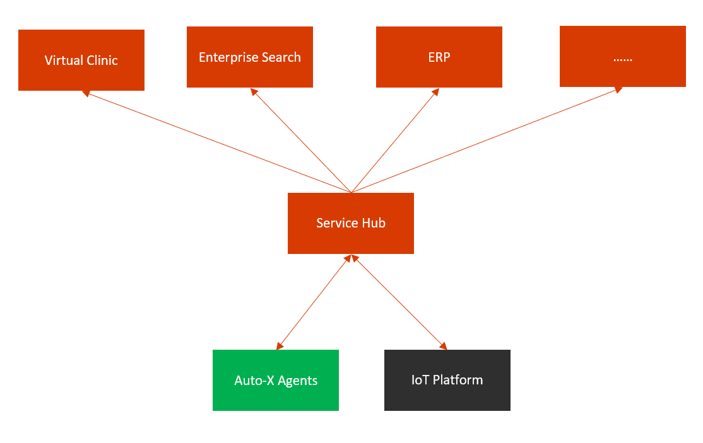

# Auto-X Services
<div  align="center">
  
</div>

## Getting Started :rocket:
1. **Open your editor**

2. **Open the Terminal** - Typically, you can do this from a 'Terminal' tab or by using a shortcut
   (e.g., `Ctrl + ~` for Windows or `Control + ~` for Mac in VS Code).

3. **Clone the Repository and Navigate into the Directory** - Once your terminal is open, you can clone the repository and move into the directory by running the commands below.

   **For Mac/Linux users** :apple: :penguin:
   ```bash
   git clone https://github.com/HairongWu/Auto-X-Services.git
   cd Auto-X-Services
   ./setup.sh
   ```
   **For Windows users** :windows:
   ```bash
   git clone https://github.com/HairongWu/Auto-X-Services.git
   cd Auto-X-Services
   ./setup.bat
   ```
4. **Follow the setup instructions from the script** - add the appropriate API keys, and once all of the services are running, travel to [http://localhost:3000](http://localhost:3000) on your web-browser.

## Service Plans
- Auto-X Clinic (based on OpenClinic GA and Open Hospital)
- Auto-X Search (based on SWIRL AI Connect and Perplexica)

- Auto-X ERP (based on ERPNext)
- Auto-X Finance (based on FinGPT)
- Auto-X Insurance (based on openIMIS)
- Auto-X EDA (based on KiCad)
- Auto-X CAD (based on FreeCAD)

- Auto-X Consultant (All-In-One)

## References

- [AgentGPT](https://github.com/reworkd/AgentGPT)